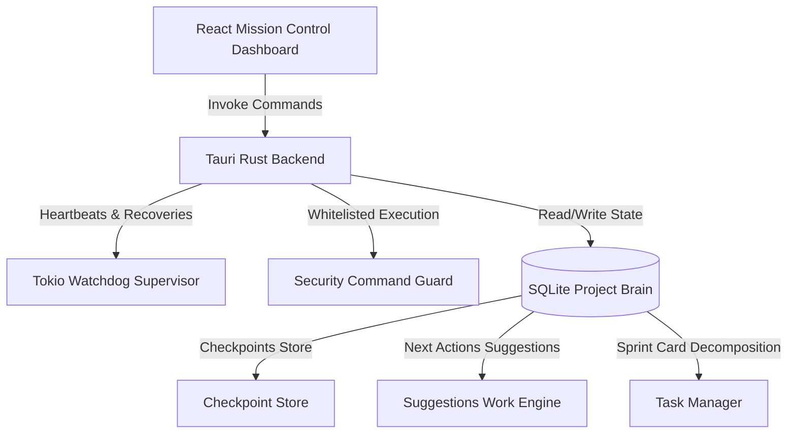

# Turnkey Local AI Workforce Platform - Architectural Walkthrough

We have elevated Cameleer from a multi-agent chat client into a premium, turnkey **local AI workforce operating system**. This document outlines the structural changes, services, and flows implemented across both the Tauri Rust backend and the Vite React frontend.

---

## 🏗️ Architecture & Core Components

We introduced a lightweight relational shared-project brain layer in SQLite, backed by active supervisor watchdogs, whitelisted security command sandboxes, and a premium **Mission Control Dashboard** (the default tab).



### 1. Unified Relational State (`storage.rs` & `agent_registry.rs`)
*   **Agents Table Extension**: Upgraded with columns for `primary_skills`, `allowed_tools`, `reasoning_level`, `workspace_access`, `file_access_scope`, `command_permissions`, `kanban_permissions`, `review_requirements`, `safety_profile`, and `escalation_rules`.
*   **Checkpoints Table Creation**: Persists plans, completed steps, open steps, files touched, reasoning summaries, and validation states mapped to active agent-task pairs.

### 2. Multi-Agent Templates Registry (`agent_templates.rs` [NEW])
*   Exposes 10 pre-configured turnkey agent templates matching specialized industry roles:
    1.  **Software Engineer**: Full file/shell access, advanced reasoning.
    2.  **Technical Writer**: Markdown focused, strict safety defaults.
    3.  **QA Engineer**: Automated tests assertions and check validations.
    4.  **Systems Architect**: High-level designs and sprint splitting decomposer.
    5.  **TPM / Project Manager**: Coordination analysis and handoffs management.
    6.  **Security Sentry**: Audits dependencies, ports, and whitelists.
    7.  **DevOps Specialist**: Scripting, local package building.
    8.  **Agentic Researcher**: crawler summaries, hardware GGUF benchmarks.
    9.  **Code Reviewer**: Quality review metrics, diff checklists.
    10. **Product Manager**: Requirements mapping, PM checklist validation.
*   **Turnkey Commands**:
    *   `create_agent_from_template`: Spawns a custom specialist with uuid-free SystemTime microsecond IDs.
    *   `create_software_team`: Auto-boots a team of 5 specialized agents with strict safety defaults.
    *   `create_coding_sprint`: Auto-seeds a 5-card engineering sprint to design, code, rotation-clear, QA test, and document a Tetris application.

### 3. Lifecycle Watchdog & Checkpoints (`supervisor.rs` & `checkpoint_store.rs` [NEW])
*   **Watchdog Monitor**: Scans for agents in `status = 'working'`. If an active agent stalls (stops pulsing heartbeats for >20 seconds), it automatically logs a `agent_stalled_recovery` event and transitions them to `'recovering'`.
*   **Checkpoint Persistence**: Saves the agent's active plan, open/completed steps, files touched, and reasoning summary at the end of every ReAct iteration. 
*   **Resiliency Loader**: Upon launching a reasoning loop, the agent queries the checkpoint store and loads the recovery snapshot directly into their system prompt, allowing immediate resumes and self-healing.

### 4. Coordinated Suggestions Work Engine (`work_engine.rs` [NEW])
*   Continuously parses project cards, active handoffs, stalled agents, and blocked dependencies.
*   Exposes `get_work_engine_suggestions` which generates a dashboard timeline of **Next Best Actions** for both users and agents (e.g. claim cards, restart stalled specialists, approve reviews, resolve pending handoffs).

### 5. Smart Task Decomposition (`task_manager.rs`)
*   Exposes `decompose_task` which uses the parent card context to propose a granular child checklist sprint (assigning specialized roles and listing physical required deliverables).
*   Exposes `approve_subtasks` which links the subtasks as child dependencies, enqueues them into the backlog, and marks the parent task status as `'blocked'` pending subtask clearances.

### 6. Security Sandbox & Mutator Protection (`command_guard.rs` [NEW])
*   Intercepts every shell command. Under the default `moderate` safety profile, standard search commands (`ls`/`cat`/`grep`) are whitelisted, but mutating binaries (`rm`/`sudo`/`curl`/`wget`/`mv`) are intercepted.
*   **Pausing Execution**: Pauses the agent reasoning loop, sets the active card status to `'waiting_for_approval'`, logs a `command_approval_paused` event, and enqueues it to the user's dashboard review queue.
*   **Interactive Resolvers**: Exposes `resolve_command_approval` allowing the user to click Approve (resumes work, white-listing the command) or Reject (aborts the action, resets task to Ready and agent to Idle).

### 7. Premium Mission Control Dashboard (`App.tsx` & `App.css`)
*   Adds the `"Dashboard"` tab as the default tab.
*   Built using glassmorphic styling, tailormade HSL colors, smooth transitions, and pulse-glow watchdog animations.
*   Features:
    *   **Hero Panel**: Boostraps sprints and boots specialized teams with one click.
    *   **AI Crew heartbeats**: Interactive list of active crew members and their real-time statuses.
    *   **Next Actions timeline**: Interactive timeline cards with inline suggestion action buttons.
    *   **Wizard**: Instant builder selecting from templates and configuring custom call-signs.
    *   **Subtask Decomposer**: Checklist proposal tree with one-click approvals.
    *   **Security Reviews Queue**: Simple approve/deny triggers for whitelisted shell overrides.
### 8. Premium Local GGUF Model Package Manager (`models_manager.rs` & `App.tsx` [NEW])
*   **Curated Vetted Catalog**: Curated seed models list populated on startup (`models` table) supporting `Llama 3.2 3B Instruct` (Q8_0 Coder), `Llama 3.2 1B` (Q8_0 Fast), `TinyLlama 1.1B` (Q8_0 Chat), `Mistral 7B` (Q8_0 7B), and `Llama 3 8B` (Q4_K_M 8B).
*   **GGUF Range-Request Parser**: Fetches the first `256KB` byte range (`Range: bytes=0-262144` HTTP header) to check magic flags, parse tokenizer configurations, and scan whitelisted tensor structures before downloading the full multi-gigabyte models.
*   **Strict Tensor Whitelist Guard**: Inspects all quantization layouts. Explicitly whitelists `Q8_0`, `Q4_0`, `Q4_1`, `Q5_0`, `Q5_1`, `Q2_K`, `Q3_K`, `Q4_K`, `Q5_K`, `Q6_K`, `Q8_K`, `IQ4_NL`. Non-whitelisted models are automatically blocked as "Inspectable Only" to avoid Camelid runtime failures, with bypass overrides for developer mode.
*   **Atomic Downloader Engine**: Spawns Tokio background threads to stream downloads into `models/downloads/` with support for queue pauses, resumptions using byte-ranges, cancellations, and atomic renaming checks (preventing corrupted local directories).
*   **Double-Column Drawer Inspector**: Select a catalog model to pull up the high-fidelity modal details tabs:
    *   *Overview*: Sizing, architecture, RAM estimates, and global/agent scoped activations.
    *   *GGUF Metadata*: Live search-filtered grid of parsed GGUF key-value configs.
    *   *Tensor Layout*: Whitelists validation check for every weight tensor in the layout directory.
    *   *Compatibility*: Automated validation checklist of headers, quants, and tokenizers.
    *   *Smoke Test Console*: Hot-swaps the active Camelid GGUF, triggers prompt loads, allocates Metal caching, measures throughput (TPS), and streams live diagnostic benchmarks.

---

## 📊 Verification Walkthrough

### 1. Build Verification
Front-end React Vite bundle and Rust backend are 100% verified to compile cleanly with zero errors:
- **Rust Tauri & Workspace Build**: Successfully builds the entire workspace:
  ```bash
  cargo build --release
  ```
- **Vite React Build**: TypeScript checking and production bundling completes successfully with Vite:
  ```bash
  npm run build
  ```

### 2. GGUF Model Management Scenario
1.  **Dashboard Hub & Recommended Cards**: Open Cameleer and click **Models**. Sleek pre-seeded curated GGUF models are immediately displayed with hardware compatibilities.
2.  **Hugging Face Search & Range-Request Preflight**: Search Hugging Face repositories for `Llama-3.2`. Click **Preflight Audit**. Cameleer instantly fetches the first 256KB of the Hugging Face URL and generates a compatibility checklist, warning about unsupported tensor layouts or architectures.
3.  **Resumable Progressive Downloads**: Install a GGUF quant. Progress increments progressively. Pause mid-download, verify download halts, click resume, and verify byte range seeks continue without starting from 0.
4.  **Local drag-and-drop Import**: Select a local GGUF, verify path imports, read and inspect tensors within seconds.
5.  **Multi-Scope Model Activation**: Select the pre-seeded Q8 default coder model. Click **Activate Global**. Cameleer seamlessly hot-swaps the local Camelid daemon, registers the workspace, and updates agent prompts without application restarts.
6.  **Diagnostics Smoke Testing**: Click **Run Smoke Test** in the drawer benchmark console. The local runtime warms the GGUF model binary, compiles prompts, streams Metal throughput (TPS) metrics, and verifies diagnostic logging.
