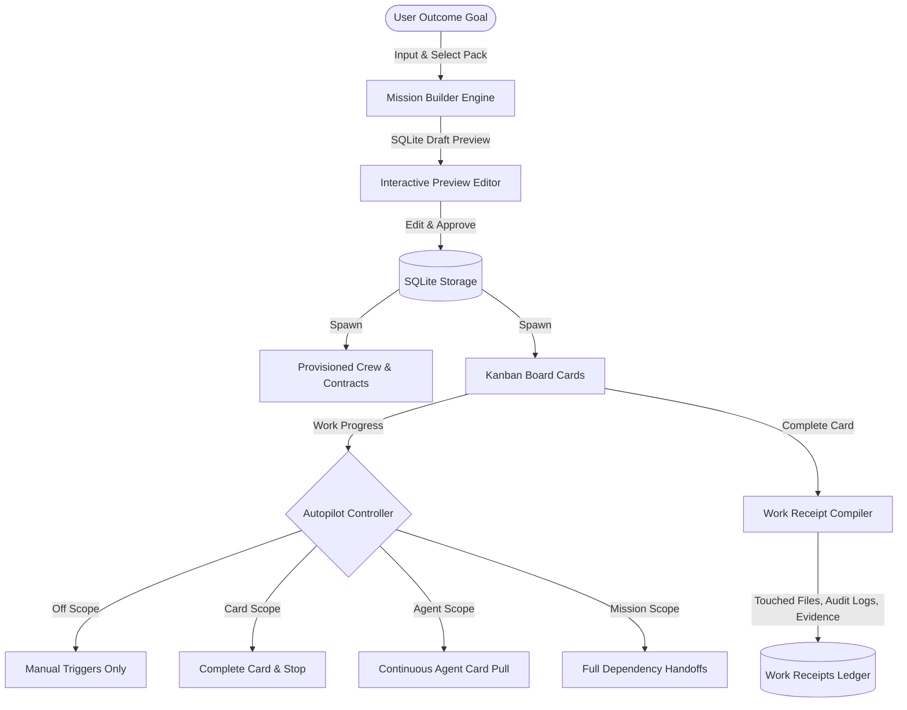

# Cameleer — Technical Walkthrough & User Guide

Cameleer is a premium, safe, and lightning-fast AI Agent system written entirely in Rust. It functions as a secure gateway that bridges your messaging environments with local machine execution via standard, portable Markdown files (`SKILL.md`).

---

## 🏗️ Architecture Overview

Cameleer is designed as a single compile target with high concurrency and safety at its core:

1. **Async Orchestrator (Tokio)**: Powers multiple concurrent communication adapters (Console TUI, Telegram poll loops, and a native Web Dashboard server) without thread starvation.
2. **ReAct Reasoning Agent**: Parses prompts, integrates context-aware conversation history from SQLite, compiles dynamic skill rules, parses action blocks, and runs a loop-prevention self-healing diagnostic layer.
3. **Structured Security Sandbox**: Acts as a strict firewall for shell execution. Whitelists binaries, catches harmful flags (like recursive deletes), and intercepts calls to prompt the active user for authorization.
4. **Relational Local Memory (SQLite)**: Persists audit traces, KV skill variables, and chat transcripts out-of-the-box.

---

## 🚀 Getting Started

### 1. Build and Compile
Since Cameleer is written in standard Rust, building is simple. Run:
```bash
cargo build --release
```
This compiles the code into a single high-performance binary under `target/release/cameleer`.

### 2. Onboard and Initialize
Run the onboarding command to create default directories (`~/.cameleer/`), configs (`~/.cameleer/config.toml`), databases, and copy default skills:
```bash
cargo run onboard
```

### 3. Start the Interactive TUI Dashboard
Simply run the program with no arguments to start the beautiful full-screen console:
```bash
cargo run
```
You can type direct messages to your agent or run slash commands inside the focused footer input box:
- `/clear` - Wipe conversation memory.
- `/exit` - Safely exit the terminal dashboard.

---

## ⚙️ Configuration Guide

Your configuration lives at `~/.cameleer/config.toml`. Here is how to customize it:

### LLM Provider Settings
You can choose between `ollama` (default local model), `anthropic`, `openai`, or `gemini`:

```toml
[llm]
provider = "ollama"         # Options: "ollama", "anthropic", "openai", "gemini"
model = "llama3"            # E.g. "claude-3-5-sonnet-latest", "gpt-4o", "gemini-1.5-pro"
ollama_url = "http://localhost:11434"
anthropic_api_key = "your_anthropic_api_key"
openai_api_key = "your_openai_api_key"
gemini_api_key = "your_gemini_api_key"
```

### Security Whitelist & Approvals
Safety is paramount in Cameleer. You can control exactly what your agent is allowed to do:

```toml
[security]
require_approval = true     # Intercepts commands and prompts you (Y/n) before running
allowed_commands = [        # Whitelisted executables the agent is allowed to invoke
    "ls", "pwd", "date", "cat", "echo", "curl", "grep"
]
allowed_paths = [           # Directories approved for read/write
    "/Users/timtoole/.gemini/antigravity/scratch/cameleer"
]
```

---

## 🛡️ Self-Healing & Loop Prevention Engine

Cameleer features a built-in diagnostic safety valve that protects the agent from derailment:
*   **Loop Protection**: If the agent attempts to invoke the exact same binary with the same parameters twice in a single ReAct cycle, the engine intercepts the call and injects a reflection warning into the history, steering it to try a new strategy.
*   **Structured Exception Diagnostic**: When a shell command returns a non-zero exit code or writes to `stderr`, the system automatically appends a diagnostic alert prompting the agent to check for typos, paths, or missing arguments, enabling autonomous correction!

---

## 💻 Full-Screen Terminal User Interface (TUI)

The terminal gateway has been completely transformed into a full-screen, responsive, multi-pane **`ratatui`** console:

### 1. Panel Layout Splits:
*   **Top Header Status**: Displays system information, current loaded LLM details, and active status (`IDLE` or `[THINKING]`).
*   **Left Column (Active Memory Thread)**: Displays a scrollable conversation view, color-coding brackets for `User` (Green), `Agent thoughts` (Magenta), and system `Tool Outcome` (Cyan).
*   **Right Column (Diagnostics & Firewall)**:
    - **Engine Diagnostics**: Real-time counters displaying loaded Whitelisted commands, ClawHub Skills, and total database audits.
    - **Active Firewall Interceptor**: Flashes in bright yellow if a mutating action is intercepted by the security sandbox.
*   **Footer Prompt Bar**: Focused input panel representing console entry.

### 2. Direct Hotkey Sandboxing:
If a command requires user permission, the input bar locks, and the Firewall pane flashes. You can press:
*   **`Y`** on your keyboard to instantly approve execution.
*   **`N`** on your keyboard to instantly deny execution.
*   This immediately updates SQLite, releasing the sandbox thread inside the background worker!

---

## 🕸️ Self-Hosted Web Control Dashboard (SPA)

Whenever the agent is running, it natively serves a zero-dependency **Web Control Dashboard & Chat Interface** at `http://localhost:8080`!

### Features:
1. **Unified Live Chat Panel**: Talk directly to the agent from your browser. View system thought processes, watch tool calls output inside customized blocks, and approve or deny sandbox requests.
2. **Interactive Skill Designer**: Hit **`+ Design New Skill`** in your browser to bring up an inline Markdown Editor, write your YAML frontmatter, and deploy playbooks instantly to `~/.cameleer/skills/`.
3. **Inline TOML Config Editor**: Fetch, validate, and write back your `~/.cameleer/config.toml` parameters without opening an external file editor.
4. **Interactive Sandbox Approvals**: Glow-pulsed cards with **Approve 🚀** and **Deny 🚫** buttons update SQLite databases immediately to resume sandbox runs.
5. **Session Hard Reset**: A warning button that cleanly purges SQLite thread records and logs for a fresh restart.

---

##  Native macOS GUI Application (Cameleer OS.app)

Cameleer is now fully packaged into a production-grade, double-clickable standalone macOS desktop application (`Cameleer OS.app`) deployed directly to your Desktop!

---

## 📥 Phase 11: Local GGUF Model Downloader & Manager

We have designed and engineered a high-fidelity **Models** configuration page inside the control center GUI, enabling native, asynchronous model downloads and active hot-swapping.

---

## ⚡ Phase 12: Dynamic Agent Model Routing & Concurrent Multi-Model Executions

Each agent in the Cameleer crew operates as a containerized worker whose inference provider and model can be dynamically configured. This enables concurrent multi-model executions live.

### 1. Curated Provider Option Lists
We introduced standard, curated select dropdown options mapped to each LLM provider:
*   **Local Camelid GGUF**: Standard downloaded files listed in `~/.cameleer/models/` + default system active GGUFs.
*   **Ollama Local API**: `qwen2.5-coder`, `llama3.2`, `llama3`, `mistral`, `deepseek-r1`.
*   **OpenAI Cloud API**: `gpt-4o`, `gpt-4o-mini`, `gpt-4-turbo`, `o1-mini`, `o1-preview`.
*   **Anthropic Claude API**: `claude-3-5-sonnet`, `claude-3-5-haiku`, `claude-3-opus`.

### 2. Smart Selector Overrides & Custom Tags
To ensure complete flexibility, the frontend automatically analyzes the active model. If an agent runs a model not present in the standard lists (e.g. a custom local fine-tune or custom API string), the dynamic dropdown resolves automatically to `"✦ Custom Model Tag..."` and renders a text `<input>` below it to permit raw overrides. This handles existing setups cleanly with zero configuration loss.

### 3. Multi-Model Concurrency Mechanics
Because each agent represents an independent entity in our relational SQLite state, they can execute distinct sandboxed operations in the background concurrently. For example:
*   `agent-coder` can run a heavy local GGUF like `Mistral-7B-Instruct-v0.3.Q8_0.gguf` via Ollama for code composition.
*   `agent-analyst` can concurrently query `gpt-4o-mini` via OpenAI for fast logical checks.
*   `agent-writer` can simultaneously run `claude-3-5-sonnet` via Anthropic for report packaging.
This allows the orchestrator to resolve dependent tasks and execute joint plans across different models simultaneously!

---

## 💎 Phase 15: Premium Productionization Suite ("Kitchen Sink" Release)

We have implemented a suite of advanced, high-fidelity enhancements that transform the workspace into a commercial-grade, premium product:

### 1. Interactive Playbook Creator & Live YAML Validator (Skills Tab)
- **Wizard Interface**: Integrated a playbook editor wizard directly into the **Skills** tab.
- **Real-Time YAML Validation**: As you write your playbook markdown, a custom JavaScript YAML parser validates required tags in real time, flashing a green validation badge or a detailed red syntax error.
- **Local Sync**: Dynamic skills playbooks are read directly from `~/.cameleer/skills/` and can be edited, deleted, or enqueued on launch, keeping the workspace synchronized.
- **Seeded Defaults**: Automatically seeds 5 high-fidelity playbooks on startup if the skills directory is empty (`file-write.md`, `shell-exec.md`, `system-info.md`, etc.).

### 2. Sandbox Firewall Telemetry Log (System Tab)
- **Log Logger**: Every file save or host command executed by the agent's ReAct loop writes a timestamped record to `~/.cameleer/sandbox_audit.log`.
- **Tailing Terminal Component**: Streams all whitelisted runs, failed command launches, and blocked recursive delete attempts in a live black terminal pane, polling every 3 seconds for active auditing.

### 3. GGUF Local Model Benchmarking Suite (System Tab)
- **Latency Matrices Test**: Measures prompt processing speeds, CPU looping performance, and Port 8181 round-trip connection speed.
- **Dynamic Comparative Bars**: Generates an interactive bar chart matching ms response latency and tokens-per-second (TPS) for local Metal GPU, CPU fallbacks, and cloud APIs.

### 4. Advanced UI Themes & Premium Glassmorphism Customizer (System Tab)
- **HSL Accent Colors Preset**: Select presets dynamically (Aqua Blue, Emerald Green, Neon Pink, Amber Yellow) to update primary styling glow borders and highlights.
- **Glass Blur Slider**: Tailors card backing backdrop blur from `4px` to `24px`.
- **Ambient backing Glow Slider**: Sets radial gradient overlay backing opacity from `0%` to `20%` instantly, persisting all configurations across sessions in `localStorage`.

---

## 🧠 Phase 16: Shared Project Context Layer (Cameleer Brain)

To resolve the agent isolation bug where sibling workers operated without joint awareness, we implemented the **Shared Project Context Layer (Cameleer Brain)**. This acts as a secure, local-first workspace brain that coordinates actions, files, and decisions across all agents in real time:

### 1. Relational SQLite Schema Upgrades
We introduced three new tables to compile the unified project brain state:
*   **`workspaces`**: Tracks active directories, paths, and status (`id`, `name`, `path`, `active`).
*   **`decisions`**: Stores key engineering choices, who decided them, and when (`id`, `workspace_id`, `decision`, `decided_by`, `timestamp`).
*   **`handoffs`**: Manages explicit, multi-agent workflows, allowing one agent to hand off tasks to another with clear context (`id`, `task_id`, `source_agent_id`, `target_agent_id`, `reason`, `status`, `timestamp`).

### 2. Context Compiler Snapshot
Before *every single turn* in the ReAct reasoning loop, the backend compiles a compact Markdown context packet comprising:
*   Active workspace and path boundaries.
*   Shared Global Goal (active objectives).
*   Active crew statuses and pulsing last-active heartbeats.
*   Recent tasks and dynamic blocker trees.
*   Created/modified workspace file artifacts.
*   Engineering decisions history.
*   Pending handoffs.
*   A tail of recent system and agent events.
*   A **dynamic, role-specific suggested next action** mapping the agent's distinct capabilities to active project needs.

### 3. Event-Driven Agent Coordination & ReAct Interceptors
*   **Turn Events Logging**: The ReAct execution loop automatically logs structured event types (`task_started`, `file_created`, `task_completed`) into SQLite on key agent mutations, creating a visual, audit-ready firewall stream.
*   **Coordinated Thought Actions**: Extended the thought parser to intercept dynamic ReAct blocks inline, empowering agents to coordinate autonomously during reasoning turns:
    - `ACTION: record_decision` ➔ Persists choice into `decisions` and logs event.
    - `ACTION: report_blocker` ➔ Registers task blocking tree and changes status.
    - `ACTION: request_handoff` ➔ Registers active multi-agent handoff inside `handoffs`.

### 4. Interactive Project Brain UI Dashboard
Completely replaced the right sidebar inspector with a high-fidelity, dual-tabbed **Project Brain Dashboard**:
*   **Project Brain Tab**: Displays active workspace name/path, crew statuses with pulsing indicators, recorded engineering decisions, the live compiled Shared Awareness terminal block, and the **Handoffs Gateway**.
*   **Interactive Handoff Resolvers**: Shows pending handoffs dynamically, providing inline, single-click **Accept**, **Reject**, or **Complete** buttons to coordinate tasks between sibling agents in real time.
*   **Manual Decision Logger**: Includes a premium inline input field enabling the active user to manually record system/architectural choices on the fly, instantly publishing events to the crew's context stream.
*   **Agent Profile Tab**: Retains quick profile inspection and retirement actions for selected agents.

---

## ⚡ Phase 17: Mission Builder Dashboard & Crew Autopilot Automation Suite

We have built a premium, secure, and extremely powerful **Mission Builder & Crew Autopilot Suite** in Cameleer. This turns the application from an agent chat application into a commercial-grade, turn-key **Local AI Workforce Platform** backed by a robust relational SQLite schema.



### 1. Unified Outcome-to-Mission Planner Dashboard
The dashboard introduces a dedicated **Missions** tab giving users high-fidelity command over crew and task automation without losing manual control:
*   **Outcome Prompt Input**: Type any high-level objective (e.g. *"Build an interactive Snake game in React with modern glassmorphic styling and sound effects"*).
*   **Mission Packs Registry**: Click on 6 pre-configured turnkey templates to kickstart standard workflows immediately:
    1.  **Build Small App**: Proposes a full software product crew (Product Manager, Coder, QA Engineer) and a progressive 4-phase backlog.
    2.  **Fix Existing Repo**: Provisions a Debugging Specialist and QA Analyst to diagnose, write tests, and resolve repository errors.
    3.  **Documentation Pass**: Spawns Technical Writers to analyze directories and generate beautiful reference sheets.
    4.  **QA Sprint**: Deploys automated testers and security auditors to write unit tests, run linters, and verify stability.
    5.  **Open Source Launch**: Sets up a release team to bundle distribution packages, compose licensing, and write readmes.
    6.  **Local AI Runtime Benchmark**: Spawns Performance Engineers to profile GGUF speeds, prompt processing latencies, and optimize parameters.
*   **Draft Preview Inspector**: Generates a side-by-side editable plan *before* any database changes occur. Users can inspect the proposed crew, adjust individual LLM models, rename roles, edit/delete cards, customize priorities, and toggle safety profiles in real time.

### 2. Relational SQLite Schema Layer
The automation suite is fully integrated into Cameleer's fast SQLite storage engine, maintaining 100% relational integrity across 10 tables:
*   `custom_mission_packs`: Tracks pre-built templates and user-saved custom crews/backlogs.
*   `mission_previews`, `mission_preview_agents`, `mission_preview_cards`, `mission_preview_dependencies`: Safely stores temporary draft preview plans so users can inspect and edit their sprints without cluttering the active board.
*   `mission_agent_contracts`: Establishes explicit boundaries, whitelists, and permissions for each spawned agent.
*   `mission_work_receipts`: Automatically captures touched files, commands executed, and user verification evidence.
*   `autopilot_settings`: Persists active workspace safety parameters, network overrides, and coordination scopes.
*   `mission_recommendations`: Feeds the recommendation engine with live tips and blockers.
*   `mission_audit_events`: Stores full, timestamped audit events of the autopilot and mission workflow.

### 3. Crew Autopilot Scope Controls & Guardrails
The optional Autopilot engine implements strict crew orchestrations and security sandboxes across four progressive scopes:
*   🔴 **Off**: Default manual control. Sibling agents work only when the user explicitly triggers them.
*   🟡 **Card**: An agent performs work only on their single, actively assigned card and stops, prompting the user for approval.
*   🟢 **Agent**: The agent continues pulling their next assigned cards from the backlog automatically, executing tasks inside the shell sandbox without manual prompts.
*   🔮 **Mission (Full Autopilot)**: The system automatically coordinates dependent cards, schedules tasks across different agents, resolves handoffs, manages review gates, and updates the board autonomously.

### 4. Smart Task Decomposition
When a user has a large, high-level task, they can hit **"Break into child cards"** directly inside the Kanban card detail overlay. The task decomposer:
*   Analyzes the active goal type and parent task description.
*   Generates a fine-grained, progressive list of child cards.
*   Associates preferred roles, required directories, and smart acceptance criteria for each subtask.
*   Renders a review checklist in the frontend UI, allowing the user to select, edit, and approve individual subtasks before spawning them on the Kanban board.

### 5. Agent Contracts & Work Receipts Ledger
To ensure predictability, transparency, and safety:
*   **Agent Contracts**: Every agent is bound to a strict contract whitelisting their directory path limits, binary access privileges, requirement review gates, and safety profiles. This is displayed directly inside the Kanban card detail pane.
*   **Work Receipts**: When a card is marked Done, the system compiles a cryptographic-style work receipt containing:
    - 📁 *Touched Files*: Live diffs and modified paths in the workspace.
    - 🐚 *Commands Executed*: Full shell logs, exit codes, and output streams.
    - 🧩 *Evidence & Validation*: User validation comments and proof of correctness.
    - *Ledger Enforcement*: The UI displays the compiled receipt inside all completed Kanban cards. No card can be moved to **Done** without an audited work receipt attached.

### 6. Security Audit Event Logger & Recommendations Timeline
*   **Recommendations Engine**: Fully integrated with the workspace timeline. It continuously analyzes the SQLite state to generate high-priority recommendations: prompting the user to decompose large cards, alerting them of missing card acceptance criteria, or notifying them of missing QA dependencies.
*   **Audit Logger Console**: Streams live events (e.g. *"[AUTOPILOT] Assigned task-234 to agent-coder"*, *"[SECURITY] Denied binary command execution 'rm -rf'"*) inside a high-fidelity terminal component in the Missions tab, keeping users fully in control of their automated workforce.

